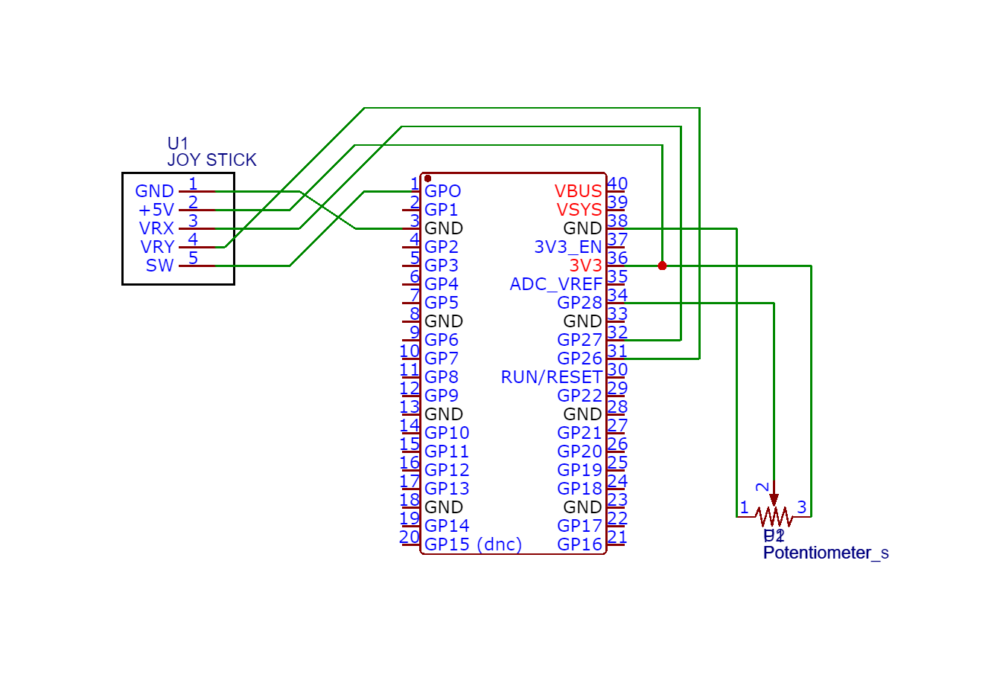

# Rendu-iot-data : Planet Explorer 🌍

Explore earth from the space !
* Use the joystick to rotate the earth 
* Use the potentiometer to zoom in and out
* Click on the joystick to set a pin point on the earth

## Members 👩‍💻🧑‍💻
 [@lucaschrng](https://github.com/lucaschrng) <br>
 [@FannyGautierr](https://github.com/FannyGautierr) 

 
## Quick Start ✅
* Go to `script.py` and change the variables `ssid` and `password` with the correct informations from your local network 
```py
ssid = "my wifi name"
password = "my wifi password"
```
* Change the variable `url` with your IP adress
```py
url = "http://YOUR_SERVER_IP_ADDRESS:3000/api/control"
```
* Start the server
```shell
$ cd server
$ npm run dev
```

## Video 🎥
[Lien de la vidéo Youtube](https://www.youtube.com/shorts/6c8O9DOlZE8)

## Components ⚙️
* Raspberry Pi Pico W
* Potentiometer
* Joystick

## Schema 📝



